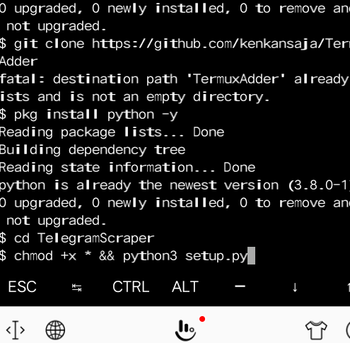
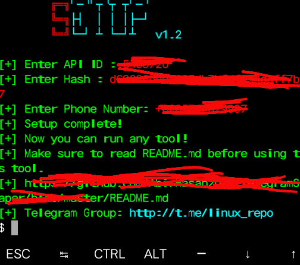
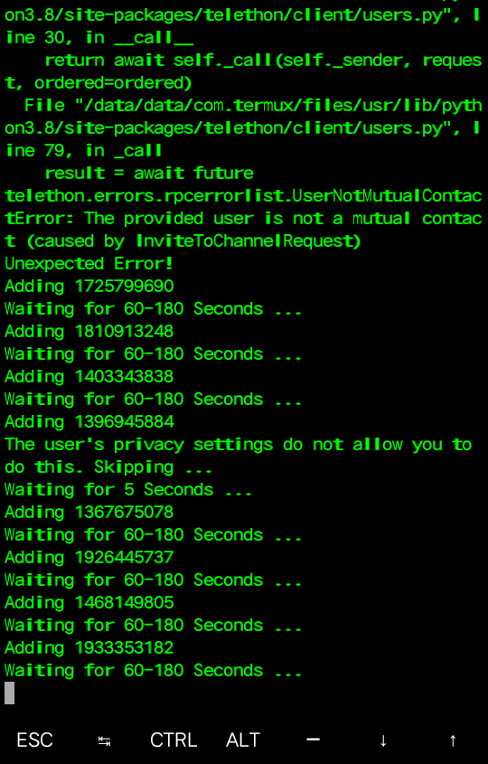

# TermuxAdder
Script add member telegram lewat termux

### Langkah pertama

```
pkg update && pkg upgrade -y
pkg install git -y
git clone https://github.com/kenkansaja/TermuxAdder
pkg install python -y
cd TelegramScraper
chmod +x * && python3 setup.py
```


### Langkah kedua setelah tahap pertama selesai

```
python3 scraper.py
```


### Langkah 3 setelah tahap kedua selesai

```
python3 adder.py
```
Kalau muncul seperti gambar di bawah berarti work



Selamat mencoba kalu ada kesalahan silahkan hubungi
[@kenkanasw](t.me/kenkanasw)


